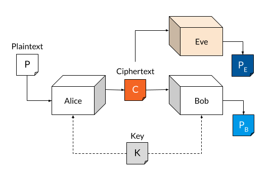
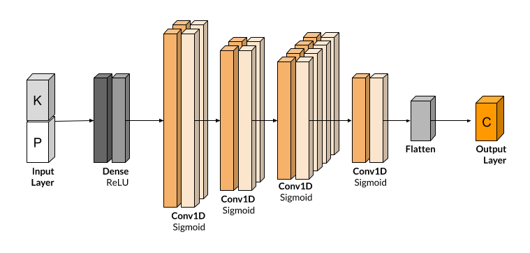

# CryptoGAN

A GAN based approach to encrypts communication between two symmetrically secure parties.
Based on the seminal paper by Abadi et al (2017) on [Adversarial Neural Cryptography](https://arxiv.org/pdf/1610.06918.pdf).

This project is an attempt to implement the concepts laid out in the literature and produce results that indicate the efficacy of neural cryptography.
This work was produced as an academic project for the B.Tech Final Year Minor Project and is a work in progress. The work done and results obtained from experiments performed
over the course of a semester are contained in the <a href="./docs/Minor Report/minorrep.pdf">project report</a>.

 

### Abstract
In this project, we demonstrate that neural networks can learn to protect communications, 
and build a network which can encrypt and decrypt bit-strings.
The learning does not require prescribing a particular set of cryptographic algorithms, 
nor indicating ways of applying these algorithms. We do not prescribe specific cryptographic 
algorithms to these neural networks; instead, we train end-to-end, adversarially. 

## Status
The project is being developed with a focus on finding a more effective strategy and use-case.
The most viable field of application seems to currently be in natual language. 

## Contributors
- Alisamar Husain

### Disclaimer
This work may not be used as an academic reference due to the lack of a peer review before publication. 
There may be errors, miscalculations or otherwise inadvertent mistakes which may be misleading or harmful.
