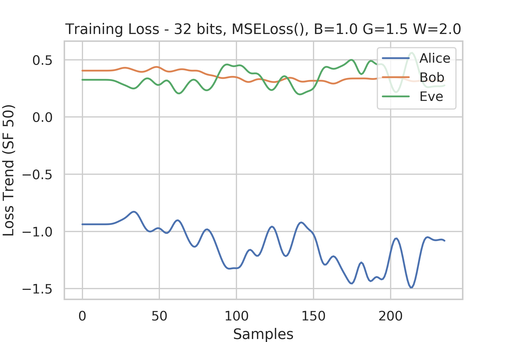
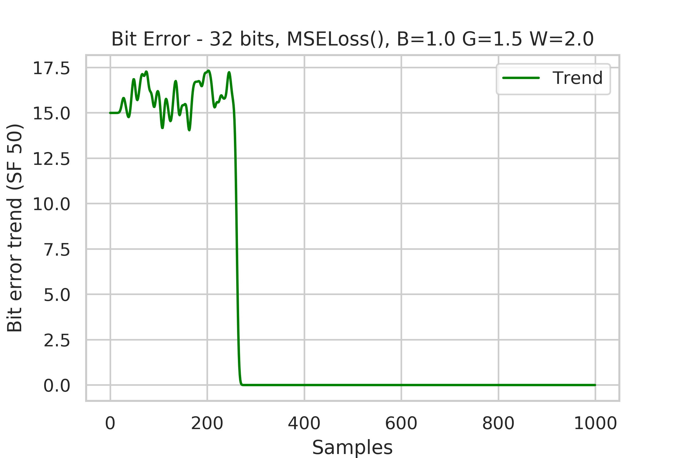

# [Notes] Coutinho Implementation

These are some notes from my implementation of the following papers and experiments.
This will help me keep a record of the things I have done and have to do.

[Learning Perfectly Secure Cryptography toProtect Communications with AdversarialNeural Cryptography](https://www.researchgate.net/publication/324727645) 
Coutinho, Murilo & Albuquerque, Robson & Borges, Fábio & García Villalba, Luis & Kim, Tai-Hoon. (2018). Sensors. 18. 10.3390/s18051306.

## Observations

- BCE Loss gives _worse_ results than L1
- HardSigmoid in last layer gives _worse_ results
- Angle transform function gives much better results
- Networks converge when Bob backpropagates before Eve and Alice

### Things I've tried

- Changing the batch size, [200, 2000, 4000]
  - Batches above 2000 give diminishing returns
  - Below 1000 network doesn't train well
- Smoothing in the trends
  - Using an average rise and fall rate makes graphs better
- Simplifying the `KeyholderNetwork` to use only Dense layers
  - Better results, but we can't be sure why
  - Faster propagation
- Random selection of which Plaintext to encrypt
  - All three P0, P1 and C go to Eve

## Results (v20)

The loss is seen to reduce over time but doesnt actually reduce smoothly.

The bit error was seen to drop to zero after a few iterations.

### Things to Try

- Introduce weights to losses, B, G and W
- Alter the model size and shape
- Use different type of encoding
